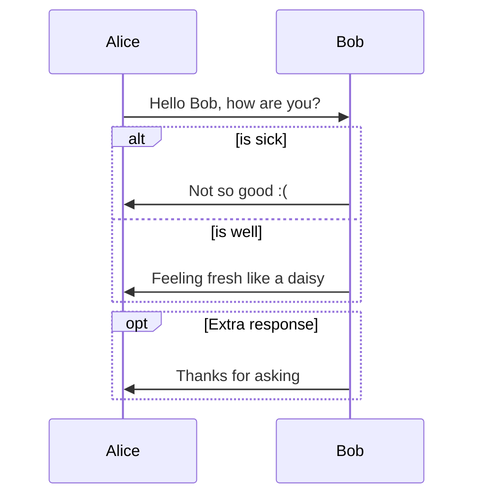
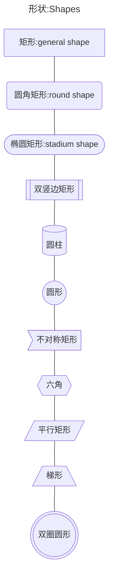
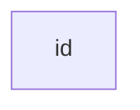

# Mermaid





# 语法:Syntax

## 术语表-Glossary

### table

| Concepts  |   中文   | definition |
| :-------: | :------: | ---------- |
| flowchart |  流程图  |            |
|   node    |   节点   |            |
|   grap    |          |            |
|    TB     | 从上往下 | top        |
|    TD     | 从上往下 |            |
|    BT     | 从下往上 |            |
|    LR     | 从左往右 |            |
|    RL     | 从右往左 |            |

### list of Glossary

## 速查表:Cheatsheet

### 形状:Shapes

```shell
|  Symbols  |       Means       |         中文名称         |
| :-------: | :---------------: | :----------------------: |
|    -->    |       link        |                          |
|   [...]   |     rectangle     |           矩形           |
|   (...)   | rounded rectangle |         圆角矩形         |
|  ([...])  |   stadium shape   | 圆竖边矩形<br />椭圆矩形 |
|  `[[...]]`  | subroutine shape  |        双竖边矩形        |
|  [(...)]  | cylindrical shape |          圆柱形          |
|  ((...))  |      circle       |           圆形           |
|   >...]   |    asymmetric     |        不对称方形        |
|    {}     |      rhombus      |           菱形           |
|  `{{...}}`  |      hexagon      |          六边形          |
|  [/.../]  |                   |         平行距形         |
| [\\...\\] |                   |        反平行矩形        |
| [/...\\]  |     Trapezoid     |           梯形           |
| [\\.../]  |                   |          倒梯形          |
| (((...))) |   Double circle   |         双圈圆形         |
```







## 流程图-FLowchart

> 参考链接
>
> [Flowchart](https://mermaid.js.org/syntax/flowchart.html#flowcharts-basic-syntax)
